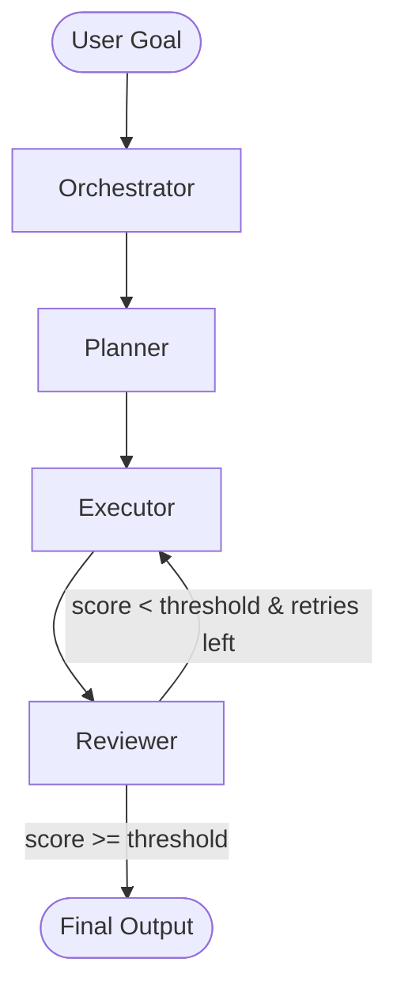

# Architecture — OPER Multi-Agent Pattern

## Overview

This repo implements the **OPER pattern**: a four-node LangGraph topology that maps any business workflow to four composable agent roles.



## Node Responsibilities

| Node | File | Responsibility |
|---|---|---|
| **Orchestrator** | `core/orchestrator.py` | Validate goal, stamp run metadata, route to Planner |
| **Planner** | `core/planner.py` | LLM call → JSON task list with tool + params per task |
| **Executor** | `core/executor.py` | Dispatch each task to tool registry, collect results |
| **Reviewer** | `core/reviewer.py` | LLM call → quality score; conditional retry edge |

## State Schema

Defined in `state/schema.py` as a `TypedDict`:

```python
class AgentState(TypedDict):
    goal: str                        # original user intent
    tasks: list[dict]                # planner output
    results: list[dict]              # executor output
    review_score: float | None       # reviewer score 0.0–1.0
    retry_count: int                 # number of executor retries
    final_output: str | None         # synthesised answer
    messages: list                   # LangGraph message history
    metadata: dict                   # run context (config, run_id, etc.)
```

## Domain Config System

Swap domains by pointing `build_graph()` at a different YAML:

```
configs/agents/
├── sales_pipeline.yaml    # 8-stage B2B sales qualification
├── support_triage.yaml    # Customer support ticket routing
└── data_analyst.yaml      # NL → SQL analytics pipeline
```

No Python changes required — only YAML.

## Tool Registry

Tools are registered via `@register_tool(name)` decorator in `tools/`:

| Tool | File | Description |
|---|---|---|
| `api_get` | `tools/api_node.py` | HTTP GET |
| `api_post` | `tools/api_node.py` | HTTP POST |
| `db_query` | `tools/db_node.py` | Read-only SQL SELECT |
| `file_read` | `tools/file_node.py` | Read text file |
| `file_write` | `tools/file_node.py` | Write text file |

## Observability

All LLM calls are traced via **Langfuse** — set `LANGFUSE_PUBLIC_KEY` and `LANGFUSE_SECRET_KEY` in `.env`.

## Retry Logic

- Reviewer scores output `0.0 – 1.0`
- If `score < PASS_THRESHOLD` (default `0.7`) AND `retry_count < MAX_RETRIES` (default `2`) → route back to Executor
- Otherwise → `END`
