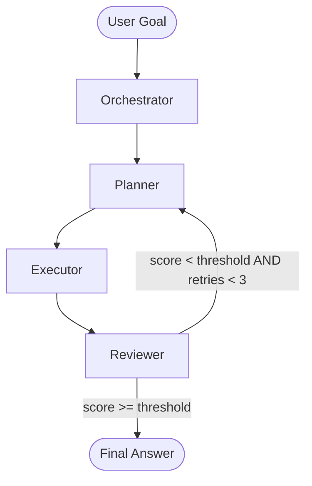

# Architecture — OPER Multi-Agent Pattern

## Overview

This repo implements the **OPER pattern**: a generalizable multi-agent orchestration framework where every pipeline decomposes into four composable roles:

| Role | Node | Responsibility |
|---|---|---|
| **O**rchestrator | `core/orchestrator.py` | Parses goal, enriches context, routes to planner |
| **P**lanner | `core/planner.py` | Breaks goal into ordered task list |
| **E**xecutor | `core/executor.py` | Runs tool calls per task |
| **R**eviewer | `core/reviewer.py` | Scores output; routes retry or done |

## LangGraph Workflow



## State Schema

```python
class MultiAgentState(TypedDict):
    goal: str                      # enriched by Orchestrator
    tasks: list[str]               # set by Planner
    results: list[str]             # set by Executor
    final_answer: str              # compiled by Executor
    review_score: float            # set by Reviewer (0.0–1.0)
    confidence_threshold: float    # from agent YAML config
    retry_count: int               # incremented by Planner
    agent_config: dict             # full YAML config payload
```

## Tool Registry

Tools are declared in `configs/tools.yaml` and registered in `tools/registry.py`. The Executor resolves tool names from the active YAML config at runtime — no hardcoded tool lists.

```
configs/agents/sales_pipeline.yaml
    tools: [db_query, api_post, file_read]
         ↓
ToolRegistry(["db_query", "api_post", "file_read"])
         ↓
[db_tool, api_tool, file_tool]  ← LangChain BaseTool instances
```

## YAML Config Swap Pattern

Swapping the agent config changes the persona, tools, and confidence threshold without touching Python code:

```bash
# Sales pipeline
python examples/run_sales_pipeline.py --goal "Q2 pipeline summary"

# Support triage
python examples/run_support_triage.py --query "Order stuck in processing"
```

## Cross-Repo Integration

```
nvidia-nim-agent-toolkit  ←  uses OPER pattern + NIM client
multi-agent-reference-architecture  (this repo)
    ↑
    └── enterprise-rag-pipeline  ←  Executor db_query tool queries RAG /query endpoint
```
