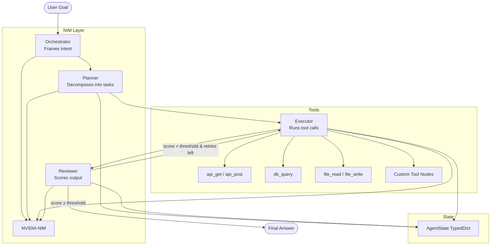

# Multi-Agent Reference Architecture — OPER Pattern

## Overview

The **OPER pattern** (Orchestrator → Planner → Executor → Reviewer) is a generalizable
multi-agent blueprint for enterprise agentic AI deployments. A single `graph_builder.py`
function assembles a LangGraph `StateGraph` from a declarative YAML config — no hardcoded pipelines.

## OPER Flow Diagram

## Key Design Decisions

- **YAML-driven:** All agent personas, model configs, tools, and domain logic live in
  `configs/agents/*.yaml` — engineers customize without touching Python
- **Single abstraction:** Every domain (sales, support, analytics) maps to the same
  OPER graph; only the YAML changes
- **Conditional retry loop:** The Reviewer routes back to Executor if `score < threshold`
  and retries remain — self-healing without infinite loops
- **Tool registry:** `ToolRegistry` dynamically imports tool functions from `tools.yaml`
  and wraps them as LangChain `StructuredTool` objects — drop-in extensible
- **NIM-native:** All LLM calls route through NVIDIA NIM's OpenAI-compatible endpoint;
  swap models by changing one YAML key

## Provided Domain Configs

| Config | Domain | Stages / Categories |
|---|---|---|
| `sales_pipeline.yaml` | B2B Sales | 8-stage pipeline (qualify → close) |
| `support_triage.yaml` | Customer Support | Severity triage + escalation routing |
| `data_analyst.yaml` | Business Analytics | SQL → interpret → executive summary |

## Adding a New Domain

1. Copy any `configs/agents/*.yaml` as a template
2. Set `name`, `description`, `model`, `tools`, `orchestrator.persona`
3. Adjust `reviewer.score_threshold` and `max_retries`
4. Run: `python -m examples.run_<your_config>`

No Python changes required.

## Cross-Repo Integration

- [`nvidia-nim-agent-toolkit`](https://github.com/TylrDn/nvidia-nim-agent-toolkit) — specialized
  NIM agents (API, SQL, Doc) can be wired in as Executor tool nodes
- [`enterprise-rag-pipeline`](https://github.com/TylrDn/enterprise-rag-pipeline) — the
  `/query` endpoint can be registered as a `rag_query` tool in any agent config
- [`agentic-guardrails-eval`](https://github.com/TylrDn/agentic-guardrails-eval) — the
  `/run` endpoint is a first-class target for red-team attack testing
