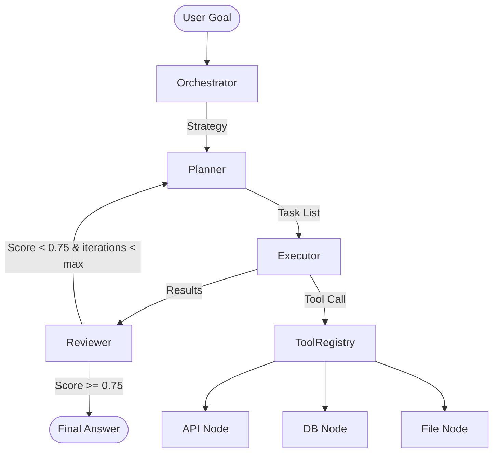
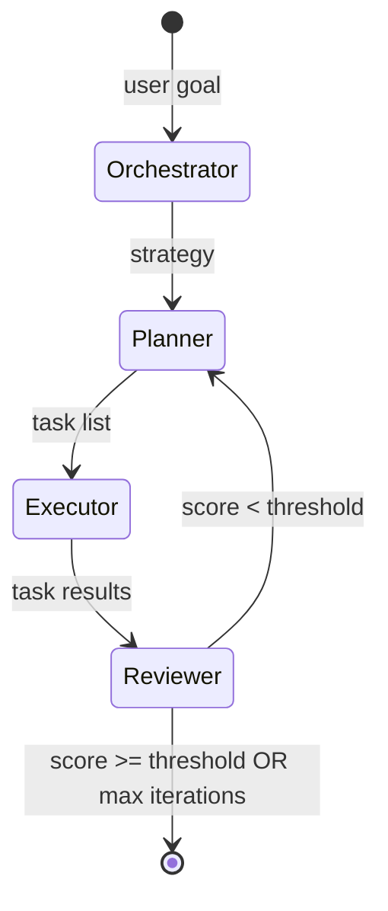
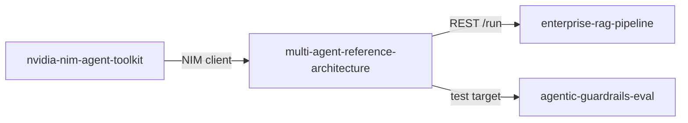

# Architecture: OPER Multi-Agent Pattern

This repo implements the **OPER pattern** — a generalizable multi-agent architecture
for enterprise agentic AI deployments built on LangGraph and NVIDIA NIM.

## Core Pattern



## Node Responsibilities

| Node | Role | Key Output |
|---|---|---|
| **Orchestrator** | Understand goal, set strategy | `strategy: str` |
| **Planner** | Decompose strategy into tasks | `tasks: list[str]` |
| **Executor** | Run tool calls per task | `task_results: list[dict]` |
| **Reviewer** | Score output, route retry/done | `review_score: float` |

## State Flow



## Config-Driven Design

The graph is assembled from YAML agent configs — no hardcoded pipelines.

```yaml
# configs/agents/sales_pipeline.yaml
name: sales_pipeline
domain: sales
model:
  provider: nvidia_nim
  name: meta/llama-3.1-70b-instruct
reviewer:
  score_threshold: 0.80
  max_iterations: 3
```

`core/graph_builder.py` reads this config and dynamically wires the LangGraph nodes.

## Tool Registry

Tools are registered in `configs/tools.yaml` and loaded dynamically:

```python
registry = ToolRegistry()
tools = registry.get_tools()   # Returns list[StructuredTool]
result = registry.invoke("web_search", {"query": "NVIDIA NIM"})
```

Supported tool types: `api` | `db` | `file`

## Cross-Repo Integration



- **Repo 1** (`nvidia-nim-agent-toolkit`): NIM client pattern sourced from here
- **Repo 2** (`enterprise-rag-pipeline`): Executor's `web_search` tool can proxy to RAG `/query` endpoint
- **Repo 5** (`agentic-guardrails-eval`): Uses this repo's `/run` endpoint as the red-team target
